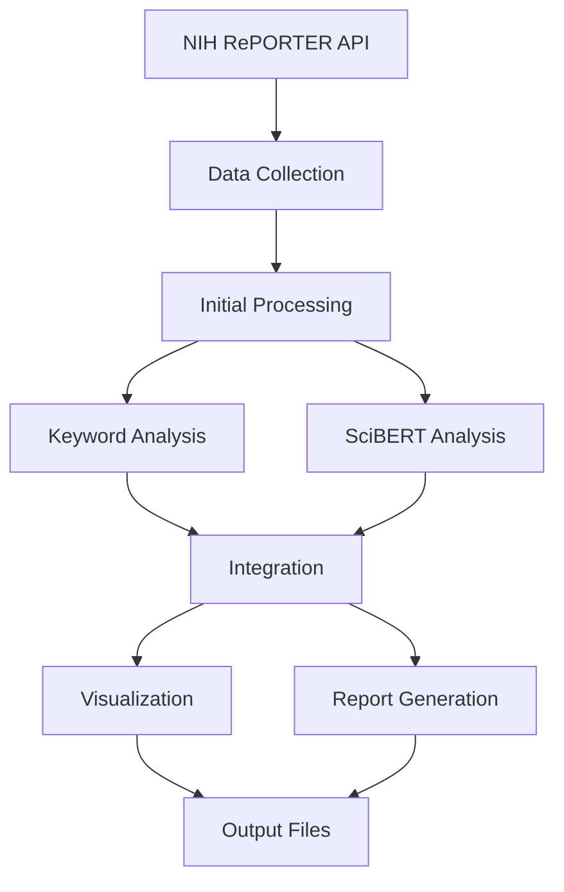

# NIH Grant Analysis Pipeline: Hybrid Keyword-AI Approach for Research Classification

## Table of Contents
- [Project Overview](#project-overview)
- [Methodology](#methodology)
- [Data Processing Flow](#data-processing-flow)
- [Quick Start Guide](#quick-start-guide)
- [Project Structure](#project-structure)
- [Understanding the Outputs](#understanding-the-outputs)
- [Tableau Visualization System](#tableau-visualization-system)
- [Customizing the Analysis](#customizing-the-analysis)
- [Interpreting Results](#interpreting-results)
- [Future Development](#future-development)
- [Contributing](#contributing)
- [License](#license)

## Project Overview
This project addresses the challenge of efficiently analyzing and categorizing NIH research grants by implementing a novel hybrid approach that combines traditional keyword-based classification with advanced AI-powered semantic analysis. The system leverages the SciBERT model, which is specifically trained on scientific text, to understand the nuanced relationships between different research projects while maintaining the precision of explicit category matching.

The project aims to solve several key challenges in grant analysis:
- Manual categorization of large volumes of grant data is time-consuming and potentially inconsistent
- Simple keyword matching might miss semantic relationships between related projects
- Traditional classification methods often fail to capture the nuanced nature of interdisciplinary research
- Geographic and institutional patterns in research funding can be difficult to identify manually

### Key Features
- Automated data collection from NIH RePORTER API
- Dual-method analysis combining keyword and AI approaches
- Dynamic category system for customizable analysis
- Comprehensive visualization suite
- Geographic and institutional analysis
- Funding pattern identification
- Research relationship mapping

## Methodology

### 1. Data Collection Phase
The pipeline begins by collecting grant data through the NIH RePORTER API:
```python
# Example of data collection process
fetcher = NIHDataFetcher(category_handler)
criteria = fetcher.create_search_criteria(
    fiscal_years=[2023, 2024],
    keywords=None
)
projects = fetcher.fetch_data(criteria)
```

#### Key Steps:
1. **API Connection**: Establishes secure connection to NIH RePORTER
2. **Data Fetching**: Retrieves grant data with specified parameters
3. **Initial Processing**: Structures raw data into analyzable format

### 2. Dual Analysis Approach

#### A. Traditional Keyword Analysis
This method uses predefined categories and keywords to classify grants:
- Processes grant titles and abstracts
- Matches against category keywords
- Identifies research areas and subtypes
- Provides explicit categorization

Example category structure:
```python
'Research_Area': {
    'keywords': ['key1', 'key2'],
    'subtypes': {
        'Subtype1': ['specific1', 'specific2']
    }
}
```

#### B. SciBERT Analysis
Leverages AI for semantic understanding:
1. Converts text to embeddings using SciBERT
2. Calculates similarity matrices
3. Identifies related grants
4. Discovers hidden patterns

```python
# SciBERT processing example
embeddings = model(text)
similarities = calculate_similarities(embeddings)
```

### 3. Integration and Analysis

The system combines both approaches:
1. **Category Assignment**:
   - Direct matches from keyword analysis
   - Semantic groupings from SciBERT
   - Confidence scores for categorizations

2. **Relationship Mapping**:
   - Grant similarity networks
   - Research cluster identification
   - Interdisciplinary connections

3. **Funding Analysis**:
   - Geographic distribution
   - Institution patterns
   - Temporal trends

### 4. Visualization and Reporting

The pipeline generates multiple visualization types:
1. **Distribution Plots**:
   - Research area distribution
   - Funding patterns
   - Geographic distribution

2. **Similarity Heatmaps**:
   - Grant relationships
   - Research cluster visualization
   - Category overlap analysis

3. **Interactive Visualizations**:
   - Timeline views
   - Network graphs
   - Funding flows

### 5. Output Generation

Final outputs include:
1. **Excel Workbook**:
   - Detailed grant data
   - Category assignments
   - Similarity scores
   - Analysis summaries

2. **Visualization Files**:
   - Static plots (.png)
   - Interactive visualizations (.html)
   - Network diagrams

3. **Summary Reports**:
   - Key findings
   - Statistical summaries
   - Recommendation highlights

## Data Processing Flow



## Quick Start Guide

### 1. Installation
```bash
# Clone the repository
git clone [repository-url]
cd nih-grant-analysis

# Create and activate virtual environment
python -m venv .venv
source .venv/bin/activate  # On Windows: .venv\Scripts\activate

# Install required packages
pip install pandas numpy torch transformers scikit-learn tqdm plotly seaborn matplotlib openpyxl requests
```

### 2. Using Sample Templates
We provide two ready-to-use category templates:
- `sample_categories_biomedical.py`: Focused on biomedical research
- `sample_categories_tech.py`: Focused on technology and computational research

To use a template:
```bash
# 1. Copy your chosen template to categories_config.py
cp sample_categories_biomedical.py categories_config.py  # For biomedical focus
# OR
cp sample_categories_tech.py categories_config.py        # For technology focus

# 2. Run the analysis
python run_analysis.py
```

## Project Structure
```
project_folder/
├── nih_data_fetcher.py          # NIH API interaction and data processing
├── categories_config.py          # Your active category configuration
├── analysis_pipeline.py          # Analysis and visualization logic
├── category_handler.py           # Category management system
├── run_analysis.py              # Main execution script
├── sample_categories_biomedical.py  # Biomedical research template
└── sample_categories_tech.py        # Technology research template
```

## Understanding the Outputs

### 1. Excel Outputs
The analysis generates an Excel file (`nih_grants_analysis.xlsx`) with multiple sheets:

#### a. Grants_Data Sheet
- Contains all processed grants with categorizations
- Each row represents a grant
- Columns include:
  - Basic grant information (ID, title, dates)
  - Funding details (amount, duration)
  - Categorization results (research areas, technology platforms)
  - Organization information

#### b. State_Analysis Sheet
- Geographic distribution of grants
- Metrics per state:
  - Total funding
  - Number of grants
  - Average award size
  - Research area distribution

#### c. Method_Comparison Sheet
- Compares regular (keyword) vs SciBERT methods
- Shows:
  - Number of categories detected
  - Average confidence scores
  - Method agreement metrics

### 2. Visualization Outputs

#### a. Research Distribution Plot (research_distribution.png)
- Bar chart showing grant distribution across research areas
- X-axis: Number of grants
- Y-axis: Research categories
- Interpretation:
  - Longer bars indicate more grants in that category
  - Shows research focus areas
  - Helps identify dominant research themes

#### b. State Funding Distribution (state_funding.png)
- Bar chart of funding by state
- X-axis: Funding amount in millions
- Y-axis: States
- Interpretation:
  - Shows geographic distribution of funding
  - Identifies major research hubs
  - Helps understand regional focus areas

#### c. Similarity Distribution (similarity_distribution.png)
- Histogram of grant similarities
- X-axis: Similarity score (0-1)
- Y-axis: Number of grant pairs
- Interpretation:
  - Peaks show common similarity levels
  - High scores (>0.8) indicate very similar grants
  - Distribution shape shows research diversity

#### d. Interactive Timeline (grant_timeline.html)
- Interactive visualization of grants over time
- Shows:
  - Grant duration
  - Award size
  - Timeline overlaps

### 3. Method Comparison

The analysis uses two methods to analyze grants:

1. **Regular (Keyword) Method**
- Based on predefined categories and keywords
- Direct matching approach
- Good for clear categorization
- Metrics shown:
  - Number of matches per category
  - Category coverage
  - Keyword hit rates

2. **SciBERT Method**
- AI-based semantic analysis
- Understands context and meaning
- Better for finding hidden relationships
- Metrics shown:
  - Similarity scores
  - Cluster analysis
  - Semantic relationships

## Tableau Visualization System

### Dashboard Overview: NIH Grant Distribution Analysis (2022-2025)

Our Tableau implementation creates an interactive dashboard with four main components, designed for comprehensive grant analysis visualization.

### 1. Geographic Distribution Map
**Purpose**: State-level visualization of grant distribution

**Components**:
```markdown
- Interactive US map
- Color gradient by grant count (10-100)
- Hover tooltips with state details
- Click functionality for filtering
```

**Implementation Steps**:
1. Create new sheet with filled map
2. Add fields:
   ```
   - Geographic Role: State
   - Color: SUM(Grant_Count)
   - Detail: State name
   - Tooltip: [Custom state information]
   ```
3. Configure color scheme:
   ```
   Base: Light gray (#f7f7f7)
   Gradient: Blues (#c6dbef → #08519c)
   ```

### 2. Research Focus Distribution
**Purpose**: Keyword analysis visualization

**Setup**:
```markdown
1. Create horizontal bar chart
2. Configure fields:
   - Rows: Category name
   - Columns: Count of Keywords
   - Sort: Descending by count
3. Add color coding by research area
```

### 3. Funding Analysis Components

#### Award Size Visualization
```markdown
- Pie chart of funding categories
- Color-coded segments
- Interactive filtering
- Clear size labeling
```

#### Temporal Trend Analysis
```markdown
- Line chart (2022-2025)
- Y-axis: Direct cost ($0K-$1,500K)
- X-axis: Fiscal years
- Trend line indicator
```

### Interactive Features

1. **State-based Filtering**
   - Click state on map
   - Updates all visualizations
   - Shows state metrics
   - Highlights related data

2. **Time Period Selection**
   - Fiscal year filtering
   - Trend analysis
   - Year-over-year comparison

3. **Research Category Interface**
   - Keyword frequency analysis
   - Category distribution
   - State-wise comparison

### Dashboard Organization
```
+-----------------+------------------+
|                 |                  |
|      MAP        |  FUNDING PIE    |
|                 |                  |
+-----------------+------------------+
|                                   |
|        TREND ANALYSIS            |
|                                   |
+-----------------------------------+
|                                   |
|     KEYWORD DISTRIBUTION         |
|                                   |
+-----------------------------------+
```

### Color Scheme Reference
```markdown
Primary Colors:
- Map Base: #f7f7f7
- Map Gradient: #c6dbef → #08519c
- Chart Elements:
  - Bars: #1f77b4
  - Lines: #ff7f0e
  - Highlights: #2ca02c
```


### Implementation Best Practices

1. **Data Preparation**
   - Clean state names
   - Standardize categories
   - Format dates consistently
   - Verify calculations

2. **Visual Design**
   - Consistent color scheme
   - Clear labeling
   - Intuitive layout
   - Informative tooltips

3. **Performance**
   - Efficient calculations
   - Optimized filters
   - Quick load times
   - Smooth interactions

## Customizing the Analysis

### 1. Modifying Categories
You can customize the analysis by:
1. Copying and modifying one of the sample templates
2. Creating your own `categories_config.py`
3. Adding new research areas or modifying existing ones

Example of adding a new research area:
```python
'Your_New_Area': {
    'keywords': ['keyword1', 'keyword2'],
    'subtypes': {
        'Subtype1': ['specific1', 'specific2'],
        'Subtype2': ['other1', 'other2']
    }
}
```

### 2. Adjusting Analysis Parameters
You can modify:
- Award size thresholds
- Similarity score thresholds
- Category detection sensitivity
- Output format preferences

## Interpreting Results for Decision Making

### 1. Research Portfolio Analysis
- Identify research concentration areas
- Spot funding gaps
- Track emerging trends
- Monitor research diversity

### 2. Funding Patterns
- Analyze award size distributions
- Study geographic patterns
- Track temporal trends
- Identify funding opportunities

### 3. Research Relationships
- Discover related research areas
- Find potential collaborations
- Identify unique research niches
- Map research landscapes

## Future Development Opportunities
1. Real-time analysis capabilities
2. Enhanced visualization options
3. Predictive analytics for funding trends
4. Integration with other data sources
5. Custom report generation

## Contributing
Contributions are welcome! Please feel free to submit Pull Requests.

## License
This project is licensed under the MIT License - see the LICENSE file for details.